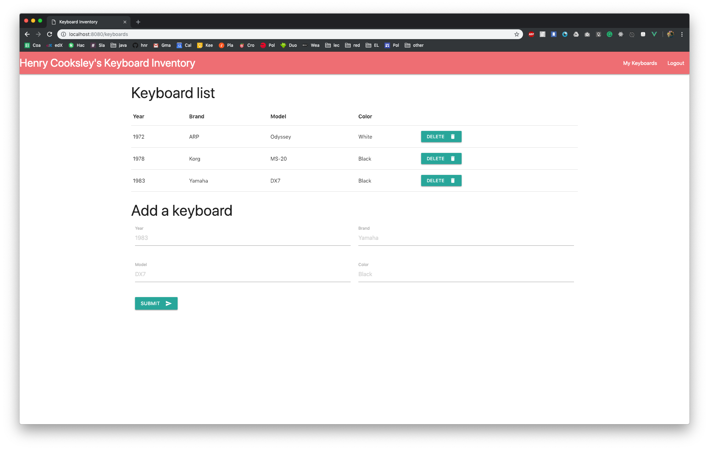

# keyboard-inventory

Tutorial: Use TypeScript to Build a Node API with Express

https://developer.okta.com/blog/2018/11/15/node-express-typescript

### Screenshot

### Technologies

This example application uses: 

* [Node.js](https://nodejs.org)
* [TypeScript](https://www.typescriptlang.org/)
* [Express](https://expressjs.com/)
* [PostgreSQL](https://www.postgresql.org/)
* [EJS](https://github.com/mde/ejs)
* [Okta's Node.js OIDC Middleware](https://www.npmjs.com/package/@okta/oidc-middleware)
* [Vue](https://vuejs.org/)
* [Materialize](https://materializecss.com/)
* [Axios](https://github.com/axios/axios)
